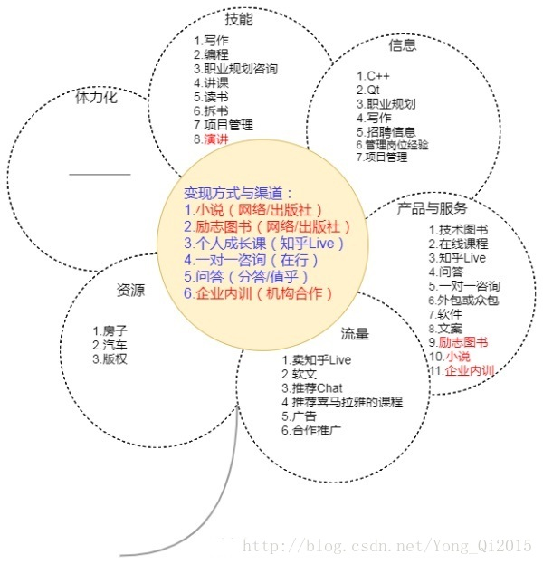
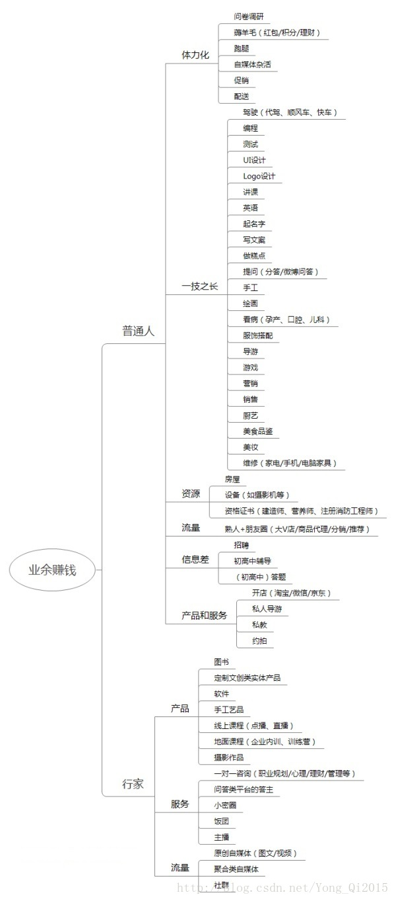

一 卖技能网址汇总
  自由人（http://www.freemancn.com/），设计，摄影，文案，插画，程序，策划，配音， 
  斗米兼职（http://www.doumi.com） 
  兼职猫（https://www.jianzhimao.com/） 
  兼职吧（http://www.jianzhi8.com/） 
  58同城兼职（http://xa.58.com/jianzhi.shtml） 
  猪八戒（http://www.zbj.com），软件开发，Logo设计，翻译，取名，硬件设计，UI设计 
  威客中国（http://www.vikecn.com/， 
  时间财富 http://www.680.com/）， 
  任务中国（http://www.taskcn.com/） 
  一品威客（http://www.epwk.com/） 
  freelancer（https://www.freelancer.cn） 
   口袋兼职（https://www.kdjz.com/） 
  手工活之家（http://www.yn288.com/） 
  中国赏金写手网（http://www.3jxs.com/） 
  写作类： 
  创世中文网（http://chuangshi.qq.com/） 
   起点（http://www.qidian.com/） 
  云起书院（http://yunqi.qq.com/） 
  晋江文学城（http://www.jjwxc.net/） 
  红袖添香（https://www.hongxiu.com/） 
  17k（http://www.17k.com/） 
  纵横中文网（http://www.zongheng.com/） 
  简书（http://www.jianshu.com/） 
  豆瓣（https://www.douban.com/）

1.1 软件开发类兼职网站汇总
软件开发类： 
  程序员客栈（https://www.proginn.com/）， 
  软件开发 云沃客（https://www.clouderwork.com/）， 
  解放号（http://www.jfh.com/）， 
  软件开发 码市（https://mart.coding.net/）， 
  开源中国众包（https://zb.oschina.net/） 
  码客帮（https://www.make8.com/） 
  测试类： https://www.mtestin.com/   http://www.alltesting.cn

1.2 翻译任务
  有道（http://f.youdao.com/） 
  语富（https://www.yufu.net/） 
  译客（http://www.easytep.com/）

1.3 其他
  讲课/课程： K12 传课网（https://chuanke.baidu.com/） 
  跟谁学（http://www.genshuixue.com） 
  综合性的在线教育平台 淘宝大学（https://daxue.taobao.com/） 
  网易云课堂（http://study.163.com/） 
  腾讯课堂（https://ke.qq.com/） 
  IT类 51CTO学院（http://edu.51cto.com/） 
  慕课学院（http://www.imooc.com/） 
   CSDN学院（http://edu.csdn.net/） 
  极客学院（https://www.jikexueyuan.com/） 
  麦子学院（http://www.maiziedu.com/） 
   游戏陪玩/代练 陪玩网（http://www.peiwanw.com/） 
  58同城搜索 网咖 驾驶技能 代驾 e代驾。 滴滴代驾。 
  陪练 驾校一点通陪练（http://pl.jxedt.com/） 
  58陪练（http://peilian.58.com/）

二 卖信息差网址汇总
  知乎（https://www.zhihu.com/） 
  在行（http://www.zaih.com/） 
  果壳（http://www.guokr.com/） 
  分答（http://fd.zaih.com/） 
  值乎（知乎App内） 微博问答（微博App ->我->微博钱包->付费内容->微博问答） 知了问答（微信公众号名字） 
  丁香医生（网站http://dxy.com/，来问丁香医生公众号） 
  春雨医生（http://www.chunyuyisheng.com/，医生端App，用户端App） 
  喜马拉雅问答（喜马拉雅App内） 
  百度经验（https://jingyan.baidu.com/）

三 卖产品和服务
  淘宝（https://www.taobao.com/） 
  京东（https://www.jd.com/） 
  当当（http://www.dangdang.com/） 
  亚马逊（https://www.amazon.cn/） 
  手工客（http://www.sogoke.com） 
  小米主题商店（http://zhuti.xiaomi.com/） 
   微信表情开放平台（https://sticker.weixin.qq.com/） 
  在行（http://www.zaih.com/） 
  辅导君（http://www.fudaojun.com/） 
  闻题鸟（http://www.tibird.com）

四 卖流量
  微博（http://weibo.com） 
  微信公众号（https://mp.weixin.qq.com） 
  一点资讯（https://mp.yidianzixun.com/） 
  头条号（https://mp.toutiao.com） 
  搜狐号（http://mp.sohu.com/） 
  新榜的分销合作（http://a.newrank.cn/） 
  喜马拉雅（App内->我的->分享赚钱） 
   GitChat（http://gitbook.cn/，GitChat公众号） 
  京东荐书联盟（微信公众号） 
  大V店（http://www.davdian.cn/，特别适合妈妈们） 
  爱奇艺（http://www.iqiyi.com/） 
  优酷（http://www.youku.com/） 
  腾讯视频（https://v.qq.com/） 
  快手（App） 
  火山小视频（App） 
  花椒（App） 
  映客（App） 
  秒拍（App） 
  陌陌（App） 
  YY（App） 
  虎牙直播（App）

五 卖资源
  滴滴（App） 
  58（http://58.com/） 
  赶集（http://ganji.com/） 
  闲鱼（App） 
  内啥（http://www.neisha.cc/） 
  中国设备租赁网（http://www.58zulin.com/） 
  人人租机（http://www.rrzuji.com） 
  租宝网（http://www.zubaowang.com/）

六 体力化
  体力： 
  UU跑腿（https://www.uupt.com/，App，公众号） 
  人人跑腿（http://www.renrenrun.com/） 
  爱跑腿（http://www.ipaotui.com/） 
  美团跑腿（App） 
   人人快送（http://www.rrkd.cn/） 
  体力化： 第一调查网（http://www.1diaocha.com/） 
  最网e调查（https://www.zcom.asia） 
  集思网（https://www.opinionworld.cn/zh-cn） 
  GTM调研社区（https://cn.globaltestmarket.com/） 
  薅羊毛（https://www.haoyangmao.cc/，https://www.haoyangmao8.com

七 三张图（财富之花）
  

