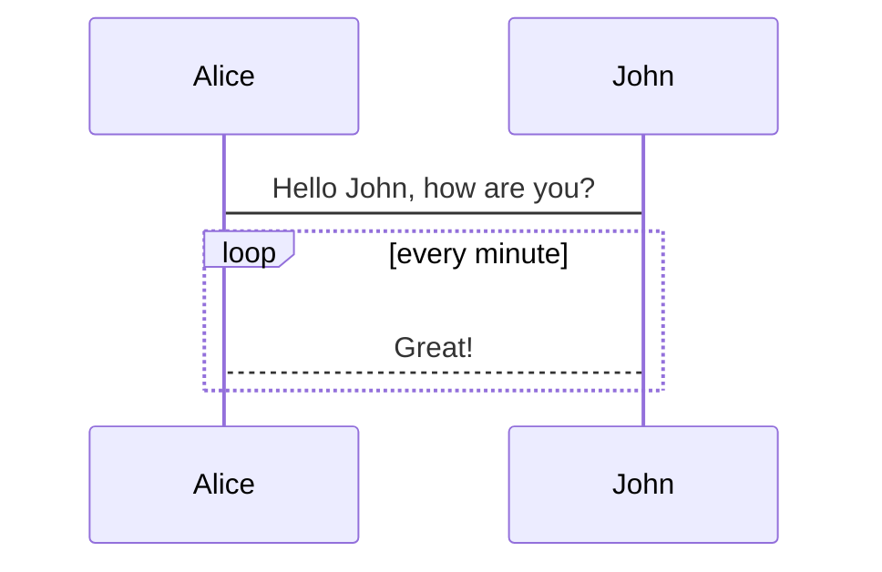
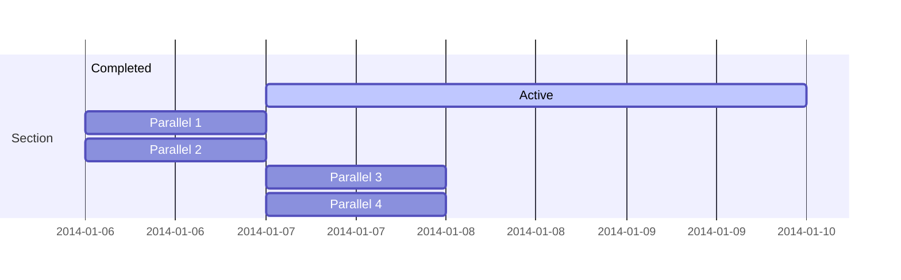
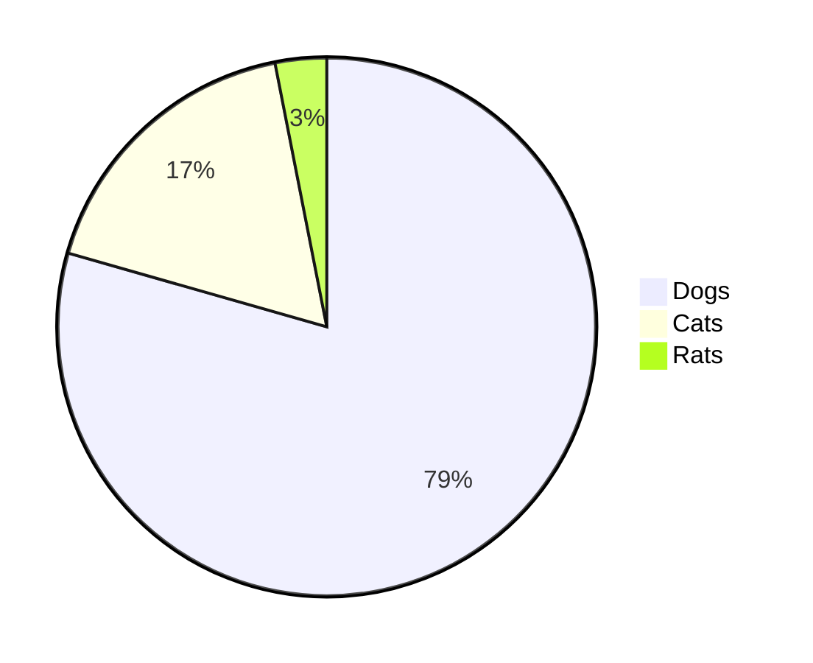

# sidebar

[[toc]]

@flowstart
st=>start: Start|past:>http://www.google.com[blank]
e=>end: End|future:>http://www.google.com
op1=>operation: My Operation|past
op2=>operation: Stuff|current
sub1=>subroutine: My Subroutine|invalid
cond=>condition: Yes
or No?|approved:>http://www.google.com
c2=>condition: Good idea|rejected
io=>inputoutput: catch something...|future

st->op1(right)->cond
cond(yes, right)->c2
cond(no)->sub1(left)->op1
c2(yes)->io->e
c2(no)->op2->e
@flowend

$$\int_{0}^{1}f(x)dx \sum_{1}^{2}\int_{0}^{1}f(x)dx \sum_{1}^{2}\int_{0}^{1}f(x)dx \sum_{1}^{2}\int_{0}^{1}f(x)dx \sum_{1}^{2}\int_{0}^{1}f(x)dx \sum_{1}^{2}\int_{0}^{1}f(x)dx \sum_{1}^{2}\int_{0}^{1}f(x)dx \sum_{1}^{2}\int_{0}^{1}f(x)dx \sum_{1}^{2}\int_{0}^{1}f(x)dx \sum_{1}^{2}\int_{0}^{1}f(x)dx \sum_{1}^{2}$$



[https://github.com/mermaid-js/mermaid](https://github.com/mermaid-js/mermaid)

## mermaid





``` js {4}
export default {
  data () {
    return {
      msg: 'Highlighted!'
    }
  }
}
```

::: tip
这是一个提示
:::

::: warning
这是一个警告
:::

::: danger
这是一个危险警告
:::

::: details
这是一个详情块，在 IE / Edge 中不生效
:::


<Vssue title="Vssue Demo" />