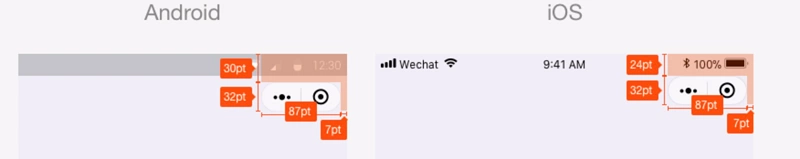
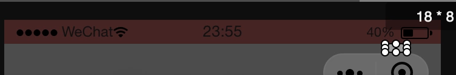
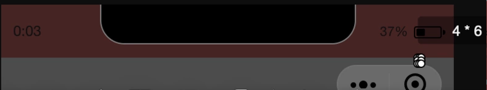

## **小程序之定义导航栏**

微信客户端 6.6.0 之后，小程序开始支持自定义导航栏。整个导航栏除了右上角的胶囊按钮之外，都可以自定义。navigationStyle 属性默认为 default，更改为 custom之后就可以开始自定义开发导航栏了。

```json
  "window": {
    "navigationStyle": "custom"
  }
```

### **开发之前准备**
在自定义导航开始开发之前，我们考虑到手机又不同的类型和屏幕大小，同时现在主流的手机系统包含两种，一个是IOS，一个是Android，那么要如何兼容这两种类型那？  
在小程序设计规范中我们找到了一些关于头部设计的规范，[戳这里跳转](https://developers.weixin.qq.com/miniprogram/design/index.html)  

   

我们可以看到胶囊按钮组的大小是32pt，这个是固定的，但是然并卵，没有其他的信息了，例如最顶部的状态栏的大小，在iponex下状态栏的大小，以及胶囊到状态栏的距离。没有这些就没法兼容各个屏幕和系统了。那么久一一来解决这些问题。  
首先状态栏的大小，我们通过查询官方文档，发现小程序API中有一个wx.getSystemInfoSync()，能过获取相应的设备或者系统的信息，通过 wx.getSystemInfoSync().statusBarHeight 可以获取到状态栏的高度，我们自定义导航栏的时候，直接赋值导航栏高度为 wx.getSystemInfoSync().statusBarHeight 的值即可。不过有一点不同，这个获取到的都是px值，所以在自定义的时候设置的值都应为 px。
但是状态栏和胶囊之间的距离是不确定的在不同系统下表现不同，具体的测量结果如下:  

Android：  
  

IOS  
  

可以看出，iOS胶囊按钮与状态栏之间距离为：6px， Android为8px，并且经过测量，iOS各机型，Android各机型结果一致。

综合一下上面的探索，可以得到以下结论：
> 1. 导航栏高度 = 胶囊按钮高度 + 状态栏到胶囊按钮间距 * 2  (上下两个边距)  
> 2. Android导航栏高度 = 32px + 8px * 2 = 48px  
> 3. iOS导航栏高度 = 32px + 6px * 2 = 44px  

有了这样的结论之后，我们就可以兼容各个手机的导航栏了。

### **开始开发**  
在开发的过程中 根据 wx.getSystemInfoSync().statusBarHeight 获取状态栏的高度，根据wx.getSystemInfoSync().system 判断是IOS还是Android，然后根据判断设置导航栏的高度。  


上代码  
.js
```js
Component({
  properties: {
    background: {
      type: String,
      value: 'rgba(255, 255, 255, 1)'
    },
    color: {
      type: String,
      value: 'rgba(0, 0, 0, 1)'
    },
    titleText: {
      type: String,
      value: '导航栏'
    },
    titleImg: {
      type: String,
      value: ''
    },
    backIcon: {
      type: String,
      value: ''
    },
    homeIcon: {
      type: String,
      value: ''
    },
    fontSize: {
      type: Number,
      value: 16
    },
    iconHeight: {
      type: Number,
      value: 19
    },
    iconWidth: {
      type: Number,
      value: 58
    }
  },
  attached: function () {
    var that = this;
    that.setNavSize();
    that.setStyle();
  },
  data: {
  },
  methods: {
    // 通过获取系统信息计算导航栏高度        
    setNavSize: function () {
      var that = this
        , sysinfo = wx.getSystemInfoSync()
        , statusHeight = sysinfo.statusBarHeight
        , isiOS = sysinfo.system.indexOf('iOS') > -1
        , navHeight;
      if (!isiOS) {
        navHeight = 48;
      } else {
        navHeight = 44;
      }
      that.setData({
        status: statusHeight,
        navHeight: navHeight
      })
    },
    setStyle: function () {
      var that = this
        , containerStyle
        , textStyle
        , iconStyle;
      containerStyle = [
        'background:' + that.data.background
      ].join(';');
      textStyle = [
        'color:' + that.data.color,
        'font-size:' + that.data.fontSize + 'px'
      ].join(';');
      iconStyle = [
        'width: ' + that.data.iconWidth + 'px',
        'height: ' + that.data.iconHeight + 'px'
      ].join(';');
      that.setData({
        containerStyle: containerStyle,
        textStyle: textStyle,
        iconStyle: iconStyle
      })
    },
    // 返回事件        
    back: function () {
      wx.navigateBack({
        delta: 1
      })
      this.triggerEvent('back', { back: 1 })
    },
    home: function () {
      this.triggerEvent('home', {});
    }
  }
})
```  
.wxml 
``` html
<view class='nav' style='height: {{status + navHeight}}px'>
  <view class='status' style='height: {{status}}px;{{containerStyle}}'></view>
  <view class='navbar' style='height:{{navHeight}}px;{{containerStyle}}'>
    <view class='back-icon' wx:if="{{backIcon}}" bindtap='back'>
      <image src='{{backIcon}}'></image>
    </view>
    <view class='home-icon' wx:if="{{homeIcon}}" bindtap='home'>
      <image src='{{homeIcon}}'></image>
    </view>
    <view class='nav-icon' wx:if="{{titleImg}}">
      <image src='{{titleImg}}' style='{{iconStyle}}'></image>
    </view>
    <view class='nav-title' wx:if="{{titleText && !titleImg}}">
      <text style='{{textStyle}}'>{{titleText}}</text>
    </view>
  </view>
</view>
```   
.wxss  
```css
.navbar{
    position: relative
}
.back-icon, .home-icon{
    width: 28px;
    height: 100%;
    position: absolute;    
    transform: translateY(-50%);    
    top: 50%;    
    display: flex;
    }
.back-icon{    
    left: 16px;
}
.home-icon{    
    left: 44px
}
.back-icon image{    
    width: 28px;    
    height: 28px;    
    margin: auto;
}
.home-icon image{    
    width: 20px;    
    height: 20px;    
    margin: auto;
}
.nav-title, .nav-icon{    
    position: absolute;    
    transform: translate(-50%, -50%);
    left: 50%;    
    top: 50%;    
    font-size: 0;    
    font-weight: bold;
}
```
.json   
``` json
{
  "component": true,
  "usingComponents": {}
}
```
自定义的导航栏几乎每个每个页面都会用到，所以可以在全局引入一下:
``` json
  "window": {
    "backgroundTextStyle": "light",
    "navigationBarBackgroundColor": "#fff",
    "navigationBarTitleText": "WeChat",
    "navigationBarTextStyle": "black",
    "navigationStyle": "custom"  // 开启自定义导航栏
  },
  "usingComponents": {
    "navigationBar": "/components/navigationBar/navigationBar" // 自定义导航栏名称
  },
```
在页面中引入组件：
``` html
<navigationBar
  title-text="自定义导航栏" 
  back-icon="/images/back@3x.png"
  home-icon="/images/home_icon@3x.png"
  background="#f2f2f2"
  bindback="back"
/>
```

### 其他方式
以上这种计算方式比较麻烦，但是能够很好的解释自定义导航栏的各个部分大小的含义，当然你也可以简单的直接使用下方公式算出导航栏大小：
```js
(wx.getMenuButtonBoundingClientRect().top - wx.getSystemInfoSync().statusBarHeight) * 2 + wx.getMenuButtonBoundingClientRect().height
``` 

